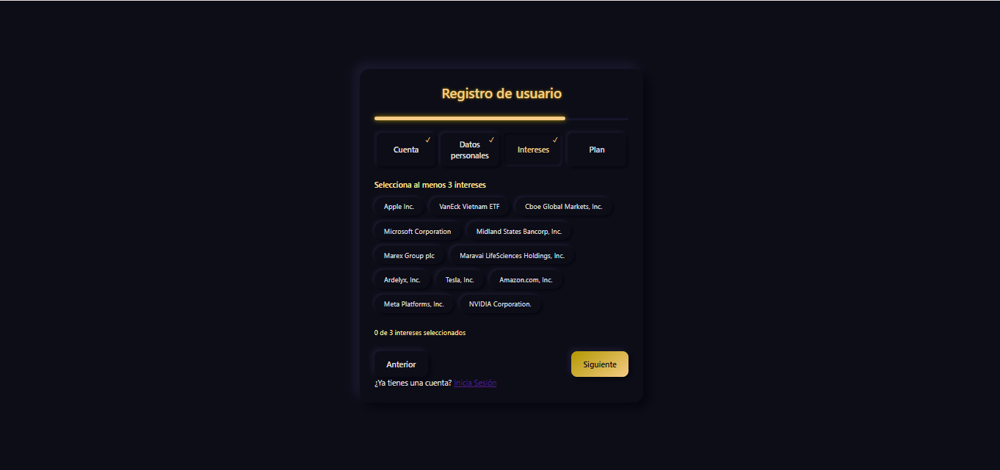
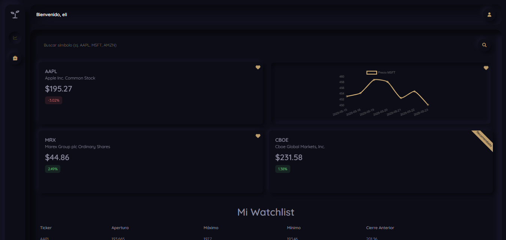

# Acciones El Bosque

Acciones El Bosque es una aplicación web desarrollada en Django y HTML/CSS/JavaScript, orientada a la compra y venta de acciones englobadas en el Day Trading. Acciones El Bosque hace uso de APIs como Alpaca, Finnhub, Yahoo Finance y Stripe para recuperar datos del mercado, realizar operaciones, registros y recargas de dinero. Todo esto desde entornos sandbox para asegurar la integridad de los datos de este software pequeño. Con una interfaz sencilla e intuitiva basa en el diseño neumórfico, Acciones El Bosque proporciona facilidad de compra/venta y visualización del comportamiento en tiempo real de acciones de interés.

## Screenshots







## Features

- Registro y validación de credenciales en la plataforma y en Alpaca.
- Dashboard con la información de acciones de interés en gráfica.
- Barra de buscador que al ingresar el ticker de alguna acción de la base de datos, se proporciona información adicional sobre ella y se da la opción de comprar acciones.
- Control de usuarios premium con funcionalidades adicionales (Watchlist)
- Área de portafolio donde aparecerán las acciones adquiridas y se dará la opción de venderlas al precio dado en el momento.
- Gestión de saldo que se actualiza y sincroniza con el sistema Alpaca y las operaciones/transacciones que se hagan con ella.
- Logs basados en ElasticSearch, Kibana y Logstash.

## Tech Stack

**Frontend:** HTML, CSS, JavaScript

**Backend:** Django (Python)

**Almacenamiento:** MySQL

## Run Locally

Antes de ejecutar el proyecto, asegurarse de tener instalado:

- Docker
- Docker Compose

Luego de clonar este repositorio

```bash
  git clone https://github.com/eligalzal/AccionesElBosque.git
  cd AccionesElBosque
```

Dirigirse a la carpeta elk_stack donde se encuentra la configuración de Docker

```bash
  cd elk_stack
```

Se realiza el comando de activación de todos los contenedores definidos en Docker

```bash
  docker-compose up
```

Y listo! se están corriendo ElasticSearch, Logstash y Kibana.

Para detener los contenedores

```bash
  docker-compose down
```

Para el proyecto de Django:

Ejecutar el proyecto

```bash
  python manage.py runserver
```
